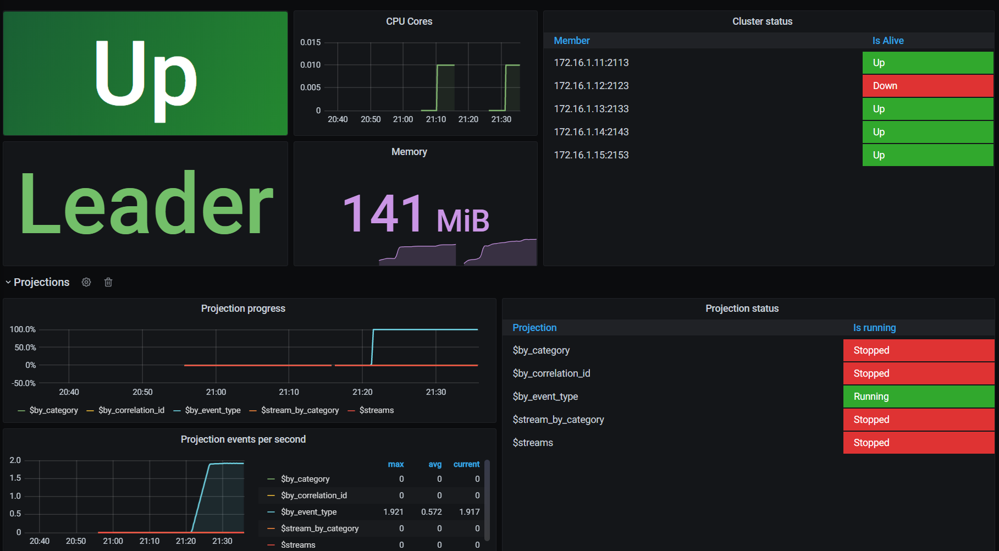

# EventStore Prometheus exporter
EventStore (https://eventstore.org/) metrics Prometheus exporter.

## Installation

### From source

You need to have a Go 1.6+ environment configured.

```bash
go get github.com/marcinbudny/eventstore_exporter
cd $GOPATH/src/github.com/marcinbudny/eventstore_exporter 
go build -o eventstore_exporter
./eventstore_exporter --eventstore-url=http://localhost:2113
```

### Using Docker

```bash
docker run -d -p 9448:9448 -e EVENTSTORE_URL=http://my-eventstore:2113 -e CLUSTER_MODE=single marcinbudny/eventstore_exporter
```

## Configuration

The exporter can be configured with commandline arguments, environment variables and a configuration file. For the details on how to format the configuration file, visit [namsral/flag](https://github.com/namsral/flag) repo.

|Flag|ENV variable|Default|Meaning|
|---|---|---|---|
|--eventstore-url|EVENTSTORE_URL|http://localhost:2113|Eventstore HTTP endpoint|
|--eventstore-user|EVENTSTORE_USER|(empty)|Eventstore user (if not specified, basic auth is not used)|
|--eventstore-password|EVENTSTORE_PASSWORD|(empty)|Eventstore password  (if not specified, basic auth is not used)|
|--cluster-mode|CLUSTER_MODE|cluster|Set to 'single' when monitoring a single node instance, set to 'cluster' when monitoring a cluster. This settings decides whether gossip stats endpoint is queired.|
|--port|PORT|9448|Port to expose scrape endpoint on|
|--timeout|TIMEOUT|10s|Timeout when calling EventStore|
|--verbose|VERBOSE|false|Enable verbose logging|
|--insecure-skip-verify|INSECURE_SKIP_VERIFY|false|Skip TLS certificatte verification for EventStore HTTP client|

## Grafana dashboard

Can be found [here](https://grafana.com/dashboards/7673)



## Exported metrics

Let me know if there is a metric you would like to be added.

```
# HELP eventstore_cluster_member_alive If 1, cluster member is alive, as seen from current cluster member
# TYPE eventstore_cluster_member_alive gauge
eventstore_cluster_member_alive{member="127.0.0.1:2113"} 1
# HELP eventstore_cluster_member_is_master If 1, current cluster member is the master
# TYPE eventstore_cluster_member_is_master gauge
eventstore_cluster_member_is_master 0
# HELP eventstore_cluster_member_is_slave If 1, current cluster member is a slave
# TYPE eventstore_cluster_member_is_slave gauge
eventstore_cluster_member_is_slave 1
# HELP eventstore_cluster_member_is_clone If 1, current cluster member is a clone
# TYPE eventstore_cluster_member_is_clone gauge
eventstore_cluster_member_is_master 0
# HELP eventstore_disk_io_read_bytes Total number of disk IO read bytes
# TYPE eventstore_disk_io_read_bytes counter
eventstore_disk_io_read_bytes 2.146304e+06
# HELP eventstore_disk_io_read_ops Total number of disk IO read operations
# TYPE eventstore_disk_io_read_ops counter
eventstore_disk_io_read_ops 2.168586e+06
# HELP eventstore_disk_io_write_ops Total number of disk IO write operations
# TYPE eventstore_disk_io_write_ops counter
eventstore_disk_io_write_ops 78755
# HELP eventstore_disk_io_written_bytes Total number of disk IO written bytes
# TYPE eventstore_disk_io_written_bytes counter
eventstore_disk_io_written_bytes 3.05152e+06
# HELP eventstore_drive_available_bytes Drive available bytes
# TYPE eventstore_drive_available_bytes gauge
eventstore_drive_available_bytes{drive="/var/lib/eventstore"} 5.7287368704e+10
# HELP eventstore_drive_total_bytes Drive total size in bytes
# TYPE eventstore_drive_total_bytes gauge
eventstore_drive_total_bytes{drive="/var/lib/eventstore"} 6.3143981056e+10
# HELP eventstore_process_cpu Process CPU usage, 0 - number of cores
# TYPE eventstore_process_cpu gauge
eventstore_process_cpu 0.0843057
# HELP eventstore_process_cpu_scaled Process CPU usage scaled to number of cores, 0 - 1, 1 = full load on all cores
# TYPE eventstore_process_cpu_scaled gauge
eventstore_process_cpu_scaled 0.04215285
# HELP eventstore_process_memory_bytes Process memory usage, as reported by EventStore
# TYPE eventstore_process_memory_bytes gauge
eventstore_process_memory_bytes 1.42651392e+08# HELP eventstore_projection_events_processed_after_restart Projection event processed count
# HELP eventstore_projection_events_processed_after_restart_total Projection event processed count
# TYPE eventstore_projection_events_processed_after_restart_total counter
eventstore_projection_events_processed_after_restart_total{projection="$by_category"} 0
# HELP eventstore_projection_progress Projection progress 0 - 1, where 1 = projection progress at 100%
# TYPE eventstore_projection_progress gauge
eventstore_projection_progress{projection="$by_category"} 1
# HELP eventstore_projection_running If 1, projection is in 'Running' state
# TYPE eventstore_projection_running gauge
eventstore_projection_running{projection="$by_category"} 1
# HELP eventstore_queue_items_processed_total Total number items processed by queue
# TYPE eventstore_queue_items_processed_total counter
eventstore_queue_items_processed_total{queue="mainQueue"} 168383
# HELP eventstore_queue_length Queue length
# TYPE eventstore_queue_length gauge
eventstore_queue_length{queue="mainQueue"} 0
# HELP eventstore_tcp_connections Current number of TCP connections
# TYPE eventstore_tcp_connections gauge
eventstore_tcp_connections 1
# HELP eventstore_tcp_received_bytes TCP received bytes
# TYPE eventstore_tcp_received_bytes counter
eventstore_tcp_received_bytes 1.304789e+06
# HELP eventstore_tcp_sent_bytes TCP sent bytes
# TYPE eventstore_tcp_sent_bytes counter
eventstore_tcp_sent_bytes 453630
# HELP eventstore_up Whether the EventStore scrape was successful
# TYPE eventstore_up gauge
eventstore_up 1
# HELP eventstore_subscription_connections Number of connections to subscription
# TYPE eventstore_subscription_connections gauge
eventstore_subscription_connections{event_stream_id="test-stream",group_name="group1"} 0
# HELP eventstore_subscription_items_processed_total Total items processed by subscription
# TYPE eventstore_subscription_items_processed_total counter
eventstore_subscription_items_processed_total{event_stream_id="test-stream",group_name="group1"} 198
# HELP eventstore_subscription_last_known_event_number Last known event number in subscription
# TYPE eventstore_subscription_last_known_event_number gauge
eventstore_subscription_last_known_event_number{event_stream_id="test-stream",group_name="group1"} 1145
# HELP eventstore_subscription_last_processed_event_number Last event number processed by subscription
# TYPE eventstore_subscription_last_processed_event_number gauge
eventstore_subscription_last_processed_event_number{event_stream_id="test-stream",group_name="group1"} 1135
# HELP eventstore_subscription_messages_in_flight Number of messages in flight for subscription
# TYPE eventstore_subscription_messages_in_flight gauge
```

## Changelog

### 0.7.0
* FIX: for items of variable count (queues, drives, projections, subscriptions, members) the exporter should not return items that have been removed (see #7)

### 0.6.0
* FEATURE: add HTTP Basic auth to support EventStore 5.0.2+ (see #6)
* FIX: when status code of http call does not indicate success, the exporter will now log a message and it won't report metrics

### 0.5.0
* FEATURE: new metrics for detecting cluster node status: `eventstore_cluster_member_is_slave` and `eventstore_cluster_member_is_clone`

### 0.4.0
* FEATURE: persistent subscription metrics

### 0.3.0
* FEATURE: added drive metrics

### 0.2.0
* FIX: missing `eventstore_process_memory_bytes` metric
* BREAKING: `eventstore_projection_events_processed_after_restart` metric renamed to `eventstore_projection_events_processed_after_restart_total` to comply with Prometheus metric naming rules

### 0.1.1

* experimenting with dockerhub tags

### 0.1.0 

* Initial version
